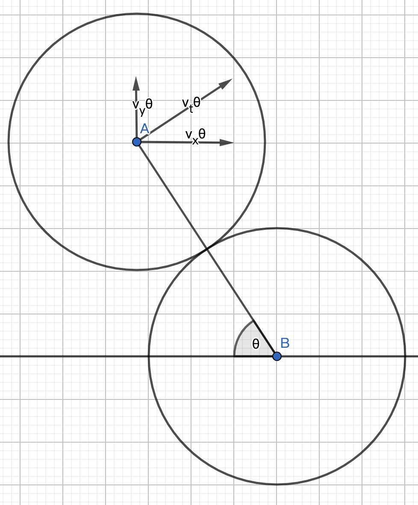

# I - Kuririn MIRACLE

## 基本信息

<table>
<tr>
<td><b>题目出处</b></td><td>2018 ICPC 亚洲区域赛青岛站网络赛</td>
</tr>
<tr>
<td><b>队伍通过率</b></td><td>7/1550 (0.5%)</td>
</tr>
</table>

## 题解

记第一辆车的圆心为 $A$，第二辆车（障碍物）的圆心为 $B$。首先容易想到答案的上界：圆 $A$ 就跟在圆 $B$ 后面沿 $x$ 轴走到终点，时间是 $\frac{d}{v}$。

由于圆 $A$ 的速度比圆 $B$ 快，也可以先让圆 $A$ 与圆 $B$ 保持相切，从圆 $B$ 上方绕过去，绕到某个角度后，再沿直线走到终点。接下来我们分别计算两段路径的时间。

### 第一段路径

点 $A$ 的第一段运动可以拆分成跟着圆 $B$ 的，速度为 $v$ 的匀速直线运动，和绕着圆 $B$ 的，半径为 $2r$ 的变速圆周运动。

<figure markdown>
{ width="500" }
</figure>

如上图所示，记 $AB$ 和 $x$ 轴负方向的夹角为 $\theta$，点 $A$ 相对点 $B$ 的切向速度为 $v_t(\theta)$，$v_x(\theta)$ 是 $v_t(\theta)$ 沿 $x$ 轴正方向的分解速度，$v_y(\theta)$ 是 $v_t(\theta)$ 沿 $y$ 轴正方向的分解速度，有以下方程组。

$$
\begin{cases}
v_x(\theta) = v_t(\theta)\sin \theta \\
v_y(\theta) = v_t(\theta)\cos \theta \\
(v_x(\theta) + v) ^ 2 + (v_y(\theta))^2 = (2v)^2
\end{cases}
$$

解得 $v_t(\theta) = v (\sqrt{\sin^2\theta + 3} - \sin\theta)$。

设第一段运动一直持续到 $\theta = \alpha$，则根据弧长公式，第一段运动的用时为

$$
t = \int_{0}^{\alpha} \frac{2rd\theta}{v_t(\theta)}
$$

这个积分没有代数解，可以使用 [自适应辛普森公式](https://en.oi-wiki.org/math/integral/#_7) 近似计算。

### 第二段路径

当点 $A$ 经过第一段路径后，坐标为

$$
\begin{cases}
x = vt + 2r - 2r\cos \alpha \\
y = 2r\sin \alpha
\end{cases}
$$

接下来，点 $A$ 将从这个坐标向终点做匀速直线运动，因此第二段运动的用时为 $\frac{\sqrt{(x - d)^2 + y^2}}{2v}$。

剩下的问题就是如何确定 $\alpha$ 的值。设第二段路径开始前，点 $A$ 和终点的连线与 $x$ 轴负方向的夹角为 $\beta$。考虑以点 $B$ 为中心的参考系，点 $A$ 在该参考系中将从 $\vec{a} = (x - (2r + vt), y)$ 出发，沿 $\vec{w} = (2v\cos \beta - v, -2v\sin \beta)$ 方向做匀速直线运动。为了保证 $AB$ 两点之间的距离不缩小，向量 $\vec{a}$ 和 $\vec{w}$ 之间的夹角不能超过 $90$ 度，即 $\vec{a} \cdot \vec{w} \ge 0$。二分 $\alpha$ 的值并检查即可。

复杂度是二分的复杂度乘以辛普森公式的复杂度。

## 参考代码

```c++ linenums="1"
#include <bits/stdc++.h>
#define EPS 1e-9
using namespace std;

double v, r, d;

int sgn(double x) {
    if (x > EPS) return 1;
    if (x < -EPS) return -1;
    return 0;
}

// --------------------
//  辛普森公式
// --------------------

double f(double x) {
    double s = sin(x);
    return 1 / (sqrt(s * s + 3) - s);
}

double simpson(double l, double r) {
    double mid = (l + r) / 2;
    return (r - l) * (f(l) + 4 * f(mid) + f(r)) / 6;
}

double calc(double l, double r, double eps, double ans) {
    double mid = (l + r) / 2;
    double fl = simpson(l, mid), fr = simpson(mid, r);
    if (abs(fl + fr - ans) <= 15 * eps) return fl + fr + (fl + fr - ans) / 15;
    return calc(l, mid, eps / 2, fl) + calc(mid, r, eps / 2, fr);
}

// --------------------
//  辛普森公式结束
// --------------------

void solve() {
    scanf("%lf%lf%lf", &v, &r, &d);

    // 直接跟在圆 B 后面走到终点
    double ans = d / v;
    const double PI = acos(-1);
    // 二分第一段运动结束时的角度
    double head = PI / 2, tail = PI;
    while (tail - head > EPS) {
        double mid = (head + tail) / 2;
        double t = 2 * r / v * calc(0, mid, EPS, simpson(0, mid));
        double x = 2 * r * (1 - cos(mid)) + v * t;
        double y = 2 * r * sin(mid);
        double beta = atan2(y, d - x);
        // 计算点乘的结果是否非负
        double dot = (x - (2 * r + v * t)) * (2 * v * cos(beta) - v) - y * (2 * v * sin(beta));
        if (sgn(dot) >= 0) {
            tail = mid;
            ans = min(ans, t + sqrt((x - d) * (x - d) + y * y) / (2 * v));
        } else {
            head = mid;
        }
    }
    printf("%.9f\n", ans);
}

int main() {
    int tcase; scanf("%d", &tcase);
    while(tcase--) solve();
    return 0;
}
```
