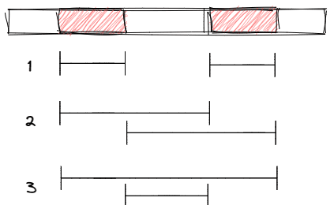

# C - Flippy Sequence

## 基本信息

<table>
<tr>
<td><b>题目出处</b></td><td>2018 ICPC 亚洲区域赛青岛站</td>
</tr>
<tr>
<td><b>队伍通过率</b></td><td>351/373 (94.1%)</td>
</tr>
</table>

## 题解

首先求出在哪些区间内，$s$ 和 $t$ 是不同的。

两次操作最多只能对两个区间进行翻转。如果不同的区间数超过两个则无解，答案为 $0$。

接下来讨论不同区间数量有 $0$，$1$，$2$ 个的情况。

### 无不同区间

若 $s$ 和 $t$ 相等，则两次操作必须翻转同一个区间，才能保持 $s$ 不变。因此答案就是非空区间的数量，即 $(\frac{n(n - 1)}{2} + n)$。

### 一个不同区间

若有一个不同的区间，有以下两类选法。设目标区间的长度为 $l$。


第一类：选择两个不相交的区间，它们的并集是目标区间。共有 $2(l - 1)$ 种方法。

第二类：选择两个相交的区间，它们的差是目标区间。共有 $2(n - l)$ 种方法。

因此答案为 $2(l - 1) + 2(n - l) = 2(n - 1)$。

### 两个不同区间

若有两个不同的区间，有以下三类选法。



两个区间有先后之分，因此答案为 $2 \times 3 = 6$。

时间复杂度 $\mathcal{O}(n)$。

## 参考代码

```c++ linenums="1"
#include <bits/stdc++.h>
#define MAXN ((int) 1e6)
using namespace std;
typedef pair<int, int> pii;

int n;
char A[MAXN + 10], B[MAXN + 10];

void solve() {
    scanf("%d%s%s", &n, A + 1, B + 1);

    // 计算不同区间
    vector<pii> vec;
    int bgn = -1;
    for (int i = 1; i <= n; i++) if (A[i] != B[i]) {
        if (A[i - 1] == B[i - 1]) bgn = i;
        if (A[i + 1] == B[i + 1]) vec.push_back(pii(bgn, i));
    }

    // 分类讨论
    if (vec.size() == 0) printf("%lld\n", 1LL * n * (n - 1) / 2 + n);
    else if (vec.size() == 1) printf("%d\n", 2 * (n - 1));
    else if (vec.size() == 2) printf("6\n");
    else printf("0\n");
}

int main() {
    int tcase; scanf("%d", &tcase);
    while (tcase--) solve();
    return 0;
}
```
