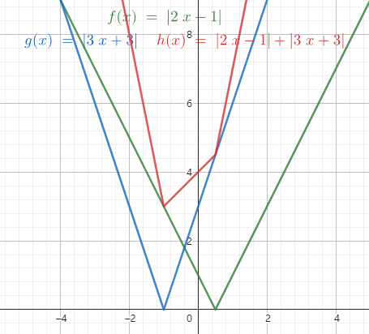

# C - Wandering Robot

## 基本信息

<table>
<tr>
<td><b>题目出处</b></td><td>2019 山东省大学生程序设计竞赛</td>
</tr>
<tr>
<td><b>队伍通过率</b></td><td>211/307 (68.7%)</td>
</tr>
</table>

## 题解

设第 $i$ 步之后机器人的坐标是 $(x_i, y_i)$，则 $(tn + i)$ 步之后机器人的坐标是 $(tx_n + x_i, ty_n + y_i)$，距离原点的曼哈顿距离为 $|tx_n + x_i| + |ty_n + y_i|$。

$f(t) = |tx_n + x_i|$ 的函数图像是一个 V 形，两个这样的函数加起来，图像是一个开口向上的，由三个一次函数组成的“碗”形。



也就是说，只有 $t$ 尽可能小或者尽可能大，曼哈顿距离才能尽可能大。而 $t \in [0, k - 1]$，因此我们只要考虑 $t = 0$ 和 $t = k - 1$ 的情况即可。

复杂度 $\mathcal{O}(n)$。

## 参考代码

```c++ linenums="1"
#include <bits/stdc++.h>
#define MAXN ((int) 1e5)
using namespace std;

int n, K;
char s[MAXN + 10];
long long ans;

void solve() {
    scanf("%d%d%s", &n, &K, s + 1);
    // (X, Y) 是 n 步之后所在的坐标
    long long X = 0, Y = 0;
    for (int i = 1; i <= n; i++) {
        if (s[i] == 'U') Y++;
        else if (s[i] == 'D') Y--;
        else if (s[i] == 'L') X--;
        else X++;
    }

    ans = 0;
    // (x, y) 是 i 步之后所在的坐标
    long long x = 0, y = 0;
    for (int i = 1; i <= n; i++) {
        if (s[i] == 'U') y++;
        else if (s[i] == 'D') y--;
        else if (s[i] == 'L') x--;
        else x++;
        ans = max({
            ans,
            // t = 0
            abs(x) + abs(y),
            // t = k - 1
            abs((K - 1) * X + x) + abs((K - 1) * Y + y)
        });
    }
    printf("%lld\n", ans);
}

int main() {
    int tcase; scanf("%d", &tcase);
    while (tcase--) solve();
    return 0;
}
```
