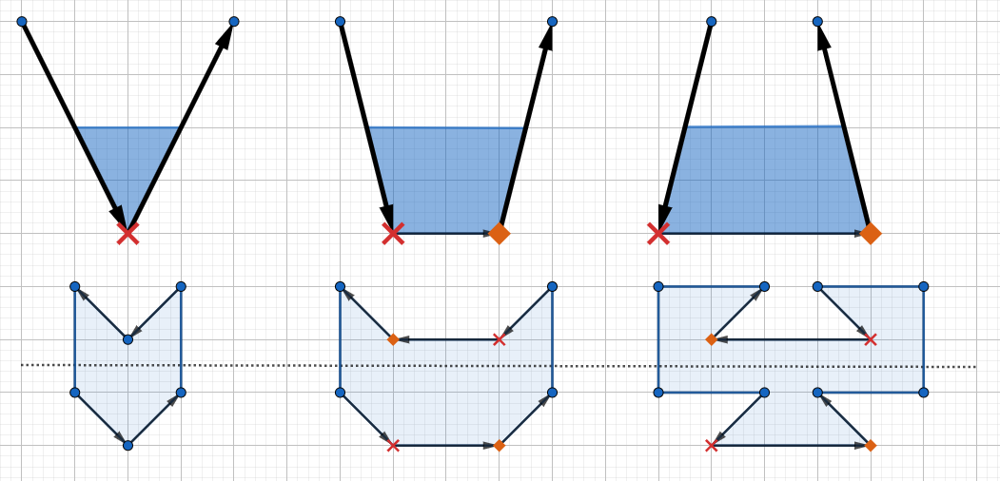

# M - 清空水箱

## 基本信息

<table>
<tr>
<td><b>题目出处</b></td><td>2022 ICPC 亚洲区域赛南京站</td>
</tr>
<tr>
<td><b>队伍通过率</b></td><td>124/465 (26.7%)</td>
</tr>
</table>

## 题解

每个局部最低点都要安装一个出水阀门，因此本题求的就是局部最低点的数量。



如上图所示，局部最低点可以按是否位于水平平面上分成两种情况。

对于第一种情况，局部最低点 $P$ 不在水平平面上。那么

* 以 $P$ 为终点的向量 $\vec v_1$ 的 $y$ 值应该小于 $0$，而以 $P$ 为起点的向量 $\vec v_2$ 的 $y$ 值应该大于 $0$。
* 为了防止“天花板”上的点被错误统计，由于多边形的顶点是按逆时针顺序给出的，因此还要额外判断 $\vec v_1 \times \vec v_2 > 0$，这里 $\times$ 是向量的叉积。请看下半部分的图像，体会虚线上方和下方相似结构在叉积结果上的区别。

对于第二种情况，局部最低点 $P$ 在水平平面上。我们不妨以平面上的第一个点 $P$ 为代表。这里的“第一个点”指的是以 $P$ 为终点的向量不是水平的。

* 以 $P$ 为终点的向量 $\vec v_1$ 的 $y$ 值应该小于 $0$，而从 $P$ 开始下一条不是水平的向量 $\vec v_2$ 的 $y$ 值应该大于 $0$。
* 为了防止“天花板”上的点被错误统计，由于多边形的顶点是按逆时针顺序给出的，因此还要额外判断 $P$ 的下一个点 $Q$。$Q$ 的 $x$ 坐标需要大于 $P$ 的 $x$ 坐标。请看下半部分的图像，体会虚线上方和下方相似结构在 $x$ 坐标关系上的区别。另外注意，这种情况下的叉积可以是任意值（请看中间和右边的图），因此无法用叉积进行判断。

枚举每个点并进行判断即可。复杂度 $\mathcal{O}(n)$。

## 参考代码

```c++ linenums="1"
#include <bits/stdc++.h>
#define MAXN 2000
using namespace std;

int n, ans;
long long X[MAXN + 10], Y[MAXN + 10];

long long cross(long long x1, long long y1, long long x2, long long y2) {
    return x1 * y2 - x2 * y1;
}

int main() {
    scanf("%d", &n);
    for (int i = 0; i < n; i++) scanf("%lld%lld", &X[i], &Y[i]);

    for (int i = 0, j = 1; i < n; i++) {
        // j 是下一个 y 值不相等的点
        while (Y[i] == Y[j]) j = (j + 1) % n;
        int pre = (i + n - 1) % n;
        if (Y[i] < Y[pre] && Y[i] < Y[j]) {
            if (Y[i] != Y[(i + 1) % n]) {
                // 情况一
                assert(j == (i + 1) % n);
                if (cross(X[i] - X[pre], Y[i] - Y[pre], X[j] - X[i], Y[j] - Y[i]) > 0) ans++;
            } else {
                // 情况二
                if (X[(i + 1) % n] > X[i]) ans++;
            }
        }
    }

    printf("%d\n", ans);
    return 0;
}
```
