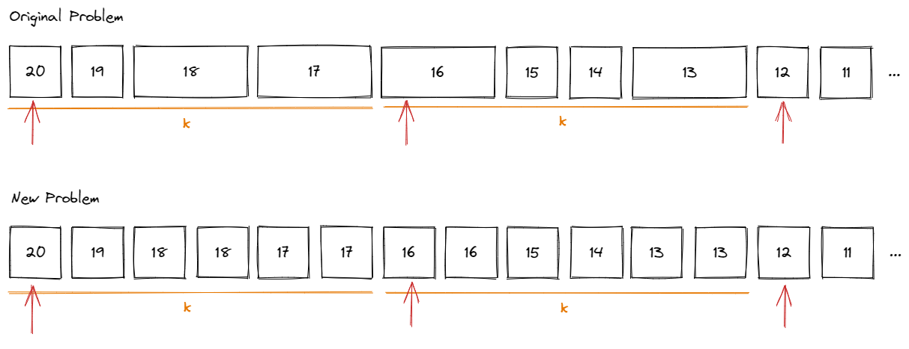

# L - 电梯

## 基本信息

<table>
<tr>
<td><b>题目出处</b></td><td>2023 ICPC 亚洲区域赛南京站</td>
</tr>
<tr>
<td><b>队伍通过率</b></td><td>125/342 (36.5%)</td>
</tr>
</table>

## 题解

### 贪心策略

我们可以使用如下贪心策略：将所有包裹（无论重量是多少）按目标楼层从高到低排序，之后每趟电梯按该顺序枚举所有还未被运送的包裹并加入电梯，直到电梯装满或所有包裹都被枚举。枚举过程中可能会出现电梯容量只剩 $1$，但是下一个包裹的重量却是 $2$ 的情况。此时要继续枚举，直到出现重量为 $1$ 的包裹。

### 贪心策略的证明

接下来证明该贪心策略的正确性。我们通过说明该贪心策略产生的答案达到了下界来说明最优性。为了求出答案的下界，我们将所有重量为 $2$ 的包裹拆成两个重量为 $1$ 的包裹，变成这样一个新问题：

给一个序列 $a_1, a_2, \cdots, a_n$，将序列中的所有数分成若干组，每组最多包含 $k$ 个数。一个分组方案的得分是所有组最大值的和，求最小得分。

由于原问题中的任何一个配送方案都能对应新问题中的一个配送方案，因此新问题的答案不比原问题大，也就是说新问题的答案就是原问题答案的下界。

这个新问题是一个经典问题，我们只要把序列从大到小排序，然后把第 $1$ 到 $k$ 个数分成一组，第 $(k + 1)$ 到 $2k$ 个数分成一组... 即可。答案就是所有下标对 $k$ 取模等于 $1$ 的数的和。

接下来证明原问题的贪心策略也能得到这个答案。我们讨论以下两种情况。在示意图中，我们用红色箭头指向每趟电梯的最大楼层，也就是真正消耗电量的包裹。

* 前面总重量为 $k$ 的货物恰好能装满一趟电梯。此时原问题和新问题消耗了相同的电能。

    

* 出现电梯容量只剩 $1$，但是下一个包裹的重量却是 $2$ 的情况。

    

    由于 $k$ 是偶数，因此在下一个重量为 $1$ 的包裹出现之前，新问题的红箭头指向的都是大包裹的后半部分。在原问题的贪心策略中，我们把下一个重量为 $1$ 的包裹移到了前面，那么中间的所有大包裹都会右移一个位置，红箭头也从大包裹的后半部分移到了前半部分。但所有红箭头指向的仍然是同一个包裹，因此答案也没有改变。

    这里还有一个特殊情况：找不到下一个重量为 $1$ 的包裹。此时我们添加一个 $f_i = 0$ 且重量为 $1$ 的包裹，即可在不影响问题答案的情况下重新利用上述证明。

这样我们就证明了原问题的贪心策略能够达到答案的下界，也就证明了贪心策略的最优性。

### 代码实现

可能您准备直接实现这个贪心策略。但根据证明过程，原问题和新问题的答案是一样的。因此我们只要求新问题的答案即可。由于包裹总数可能很多，我们要用除法快速计算目的地相同的包裹对答案的影响。

总复杂度 $\mathcal{O}(n\log n)$，主要是排序的复杂度。

## 参考代码

```c++ linenums="1"
#include <bits/stdc++.h>
using namespace std;
typedef pair<int, int> pii;

int n;
long long K, ans;
vector<pii> A;

void solve() {
    scanf("%d%lld", &n, &K);

    A.clear();
    for (int i = 1; i <= n; i++) {
        int x, y, z; scanf("%d%d%d", &x, &y, &z);
        // 把所有大小为 2 的包裹拆成两个大小为 1 的包裹
        A.push_back(pii(-z, x * y));
    }
    // 按楼层从高到低排序
    sort(A.begin(), A.end());

    ans = 0;
    // now：这一趟电梯的最高楼层
    // sm：现在电梯里已经放了多少包裹
    long long now = -A[0].first, sm = 0;
    // 依次处理每种包裹
    for (pii p : A) {
        sm += p.second;
        // 新包裹的加入导致电梯里放了超过 K 个包裹
        if (sm > K) {
            ans += now;
            now = -p.first;
            sm -= K;
            
            // 用除法快速处理同一种包裹
            // 这里分子是 sm - 1，是为了防止 sm % K == 0 的情况，导致 now 的值出错
            long long t = (sm - 1) / K;
            ans += now * t;
            sm -= t * K;
        }
    }
    ans += now;

    printf("%lld\n", ans);
}

int main() {
    int tcase; scanf("%d", &tcase);
    while (tcase--) solve();
    return 0;
}
```
